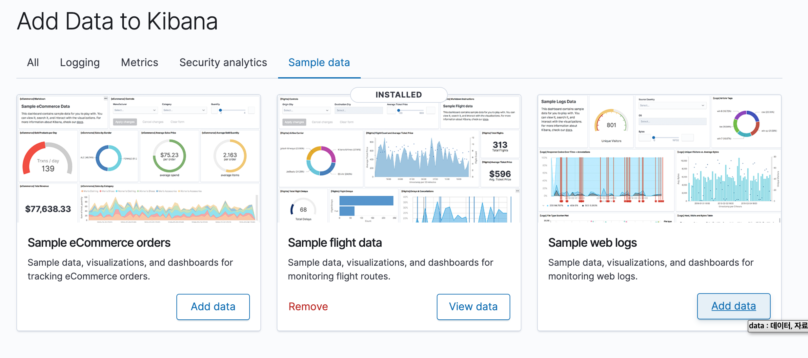
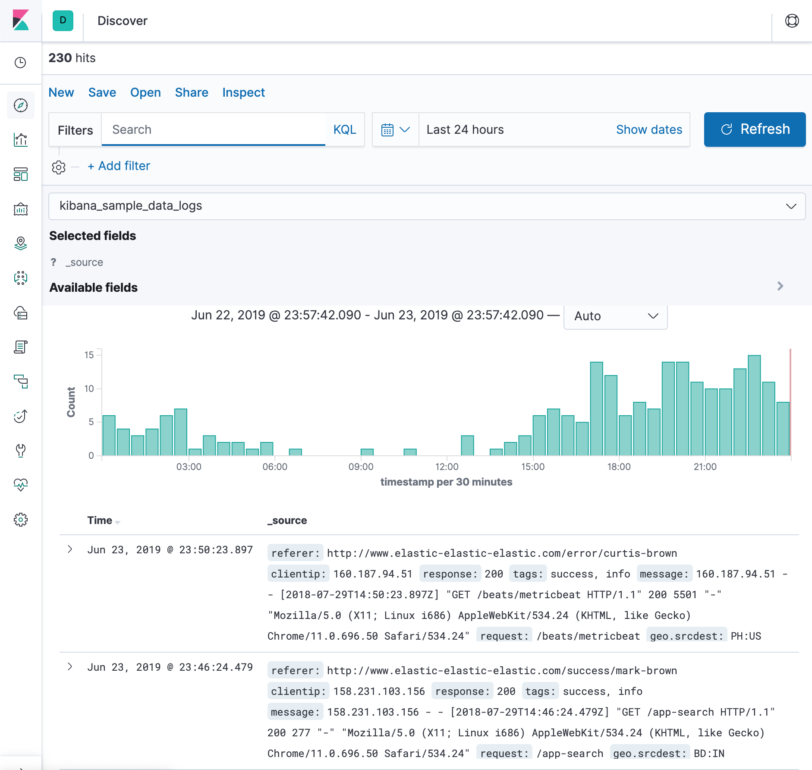

= 엘라스틱서치 로컬환경 구성하기

엘라스틱 서치의 경우 로컬 설치가 가능하지만, 클러스터 환경 구성을 위해선 독립적인 환경이 필요할 것이다. docker compose를 이용하여 환경을 구성해 보도록 하자.

ES환경에 대한 조회나 모니터링을 위해서 추가로 kibana 역시 설치할 수 있도록 하였다.

docker-compose.yaml
[source, yaml]
----
version: '2.2'
services:
  es01:
    image: docker.elastic.co/elasticsearch/elasticsearch:7.1.1
    container_name: elasticsearch
    environment:
      - node.name=es01
      - discovery.seed_hosts=es02
      - cluster.initial_master_nodes=es01,es02
      - cluster.name=docker-cluster
      - bootstrap.memory_lock=true
      - "ES_JAVA_OPTS=-Xms512m -Xmx512m"
    ulimits:
      memlock:
        soft: -1
        hard: -1
    volumes:
      - esdata01:/usr/share/elasticsearch/data
    ports:
      - 9200:9200
    networks:
      - esnet
  es02:
    image: docker.elastic.co/elasticsearch/elasticsearch:7.1.1
    container_name: elasticsearch2
    environment:
      - node.name=es02
      - discovery.seed_hosts=es01
      - cluster.initial_master_nodes=es01,es02
      - cluster.name=docker-cluster
      - bootstrap.memory_lock=true
      - "ES_JAVA_OPTS=-Xms512m -Xmx512m"
    ulimits:
      memlock:
        soft: -1
        hard: -1
    volumes:
      - esdata02:/usr/share/elasticsearch/data
    networks:
      - esnet
  kibana:
    container_name: kibana
    image: docker.elastic.co/kibana/kibana:7.1.1
    ports:
      - 5601:5601
    networks:
      - esnet
volumes:
  esdata01:
    driver: local
  esdata02:
    driver: local
networks:
  esnet:
----

위의 docker compose 설정은 Elastic search 가이드 문서에 상세하게 안내되어있다.

* https://www.elastic.co/guide/en/elasticsearch/reference/current/docker.html
* https://www.elastic.co/guide/en/kibana/current/docker.html

`docker-compose -p es up -d` 명령어를 통해서 docker compose를 실행할 수 있도록 하자.

정상적으로 도커가 기동되었다면 다음과 같이 curl 명령어를 통해서 ES의 상태를 확인할 수 있을것이다.

----
❯ curl -i http://127.0.0.1:9200
HTTP/1.1 200 OK
content-type: application/json; charset=UTF-8
content-length: 500

{
  "name" : "es01",
  "cluster_name" : "docker-cluster",
  "cluster_uuid" : "T3EmWIOUTS2-rlDXkpqDQQ",
  "version" : {
    "number" : "7.1.1",
    "build_flavor" : "default",
    "build_type" : "docker",
    "build_hash" : "7a013de",
    "build_date" : "2019-05-23T14:04:00.380842Z",
    "build_snapshot" : false,
    "lucene_version" : "8.0.0",
    "minimum_wire_compatibility_version" : "6.8.0",
    "minimum_index_compatibility_version" : "6.0.0-beta1"
  },
  "tagline" : "You Know, for Search"
}
----

kibana는 `http://127.0.0.1:5601` 로 접속이 가능하다.

처음 시작하는 경우 kibana에서 샘플데이터를 설정할 수 있다. 이를 통해서 예제데이터를 밀어넣도록 하자.

kibana의 discover탭에서 현재 생성된 인덱스와 데이터를 확인할 수 있다.
